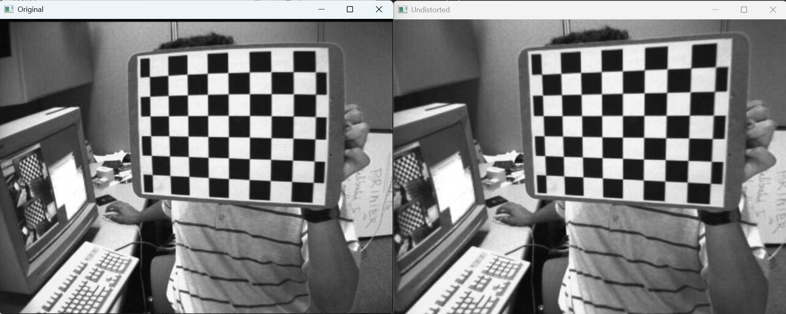
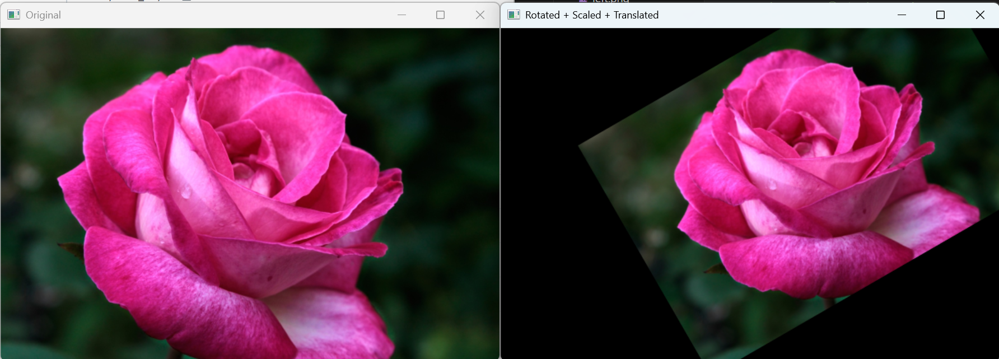
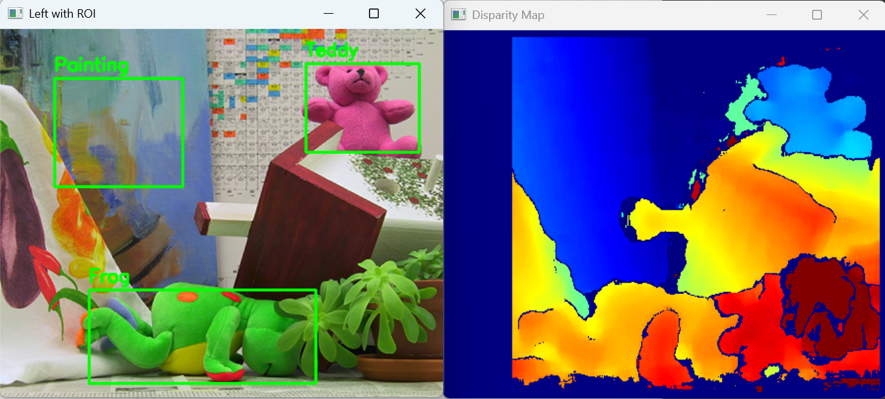
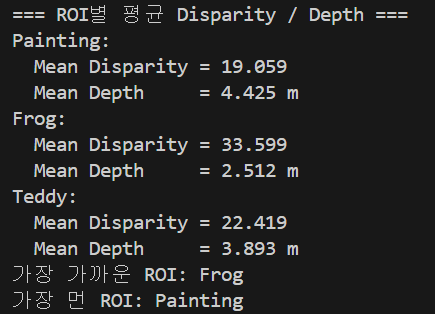

# Computer Vision


## 실습2_1 체크보드 기반 카메라 캘리브레이션

- 이미지에서 체크보드 코너를 검출하고 실제 좌표와 이미지 좌표의 대응 관계를 이용하여 카메라 파라미터 추정
- 체크보드 패턴이 촬영된 여러 장의 이미지를 이용하여 카메라 내부 행렬과 왜곡 계수를 계산하여 왜곡 보정

### 요구사항
1. 모든 이미지에서 체크보드 코너를 검출
2. 체크보드의 실제 좌표와 이미지에서 찾은 코너 좌표를 구성
3. cv2.calibrateCamera를 사용하여 카메라 내부 행렬 k와 왜곡 계수를 구함
4. cv2.undistort()를 사용하여 왜곡 보정한 결과를 시각화

### 전체 코드
```python
import cv2 #opencv라이브러리 불러오기
import numpy as np #수칙계산용 NumPy 라이브러리 불러오기
import glob #특정 경로의 여러 이미지 파일명을 한번에 불러오기위한 모듈

# 체크보드 내부 코너 개수
CHECKERBOARD = (9, 6)

# 체크보드 한 칸 실제 크기 (mm)
square_size = 25.0

# 코너 정밀화 조건
criteria = (cv2.TERM_CRITERIA_EPS + cv2.TERM_CRITERIA_MAX_ITER, 30, 0.001)

# 실제 좌표 생성
objp = np.zeros((CHECKERBOARD[0]*CHECKERBOARD[1], 3), np.float32)
objp[:, :2] = np.mgrid[0:CHECKERBOARD[0], 0:CHECKERBOARD[1]].T.reshape(-1, 2)
objp *= square_size

# 저장할 좌표
objpoints = []
imgpoints = []

#이미지 파일들을 모두 불러오기
images = glob.glob("L02_lab\images\calibration_images/left*.jpg")
img_size = None #이미지 크기를 저장하기 위한 변수

# -----------------------------
# 1. 체크보드 코너 검출
# -----------------------------

for fname in images: #불러온 모든 이미지 파일에 대해 반복 수행
    img = cv2.imread(fname) #현재 파일 경로의 이미지를 읽어옴
    if img is None: #이미지가 정상적으로 읽히는지 확인
        print(f"이미지를 읽을 수 없습니다: {fname}")
        continue
    #코너검출을 위해 이미지를 그레이스케일로 변환
    #코너 검출은 색이 아닌 명암의 변화를 보고 계산 속도를 줄일 수 있기 때문
    gray = cv2.cvtColor(img, cv2.COLOR_BGR2GRAY)
    #현재 이미지의 크기 저장
    img_size = gray.shape[::-1]  # (width, height)

    #체크보드 내부 코너를 검출함
    #ret=검출 성공 여부, corners=검출된 코너 좌표
    ret, corners = cv2.findChessboardCorners(gray, CHECKERBOARD, None)

    #코너가 정상적으로 검출된 경우
    if ret:
        #이미지에 대한 실제 좌표를 objpoints 리스트에 추가
        objpoints.append(objp) 

        # 코너 정밀화
        #(11,11)->탐색 윈도우 크기, (-1,-1)-> dead zone 없음을 의미
        corners2 = cv2.cornerSubPix(gray, corners, (11, 11), (-1, -1), criteria)
        #정밀화된 코너 좌표를 imgpoints 리스트에 추가
        imgpoints.append(corners2)
    #체크보드 코너 검출에 실패한 경우 출력
    else:
        print(f"코너 검출 실패: {fname}")
cv2.destroyAllWindows()#반복이 끝난 뒤 opencv 창을 모두 닫기

# -----------------------------
# 2. 카메라 캘리브레이션
# -----------------------------

#검출한 실제 좌표(obgpoint)와 이미지 좌표(imgpoint)를 이용해 
#카메라 내부 행렬(k), 외곡계수(dist), 회전/이동 벡터를 계산
ret, K, dist, rvecs, tvecs = cv2.calibrateCamera(
    objpoints, #실제 세계 좌표(3d)
    imgpoints, #이미지 좌표(2d)
    img_size,  #이미지 크기
    None,      #초기 카메라 행렬값 없음
    None       #초기 왜곡 계수값 없음
)

#계산된 카메라 내부 행렬 출력
print("Camera Matrix K:")
print(K)

#계산된 왜곡 계수 출력
print("\nDistortion Coefficients:")
print(dist)

#재투영 오차 출력
#값이 작을수록 보정이 잘 된 것으로 간주
print("\nReprojection Error:")
print(ret)

# -----------------------------
# 3. 왜곡 보정 시각화
# -----------------------------
#첫번째 이미지를 불러와 왜곡 보정 전을 보여줌
test_img = cv2.imread(images[0])

#계산한 카메라 행렬 K와 왜곡 계수 dist를 이용해 이미지를 보정
undistorted = cv2.undistort(test_img, K, dist, None, K)

cv2.imshow("Original", test_img) #원본 이미지를 화면에 출력
cv2.imshow("Undistorted", undistorted) #왜곡 보정된 이미지를 화면에 출력
cv2.waitKey(0) #키입력이 들어올 때까지 화면을 유지
cv2.destroyAllWindows() #모든 opencv창 닫기
```
### 결과 이미지


### 기억사항
```python
ret, corners = cv2.findChessboardCorners(gray, CHECKERBOARD, None)
```
cv2.findChessboardCorners()를 사용하여 체크보드의 코너검출
corners에 찾은 코너들의 좌표를 저장
ret을 사용하여 검출에 실패하면 캘리브레이션에서 제외하고 다음 사진으로 넘어감

```python
 objpoints.append(objp)
```
실제 세계 좌표 저장
체크보드의 실제 구조는 모든 사진에서 동일하다(모두 같은 체크 보드를 사용하여 찍은 사진)
그렇기 때문에 사진마다 사진에 대응되는 실제 좌표도 함께 저장해 주어야한다.

```python
ret, K, dist, rvecs, tvecs = cv2.calibrateCamera(
    objpoints, #실제 세계 좌표(3d)
    imgpoints, #이미지 좌표(2d)
    img_size,  #이미지 크기
    None,      #초기 카메라 행렬값 없음
    None       #초기 왜곡 계수값 없음
)
```
objpoint, imgpoints, img_size를 이용하여 다음에 오는 카메라의 특성을 계산한다
K:렌즈정보
dist: 왜곡 정보
rvecs: 각도
tvecs: 위치

```python
undistorted = cv2.undistort(test_img, K, dist, None, K)
```
캘리브레이션을 통해 얻은 값들을 이용하여 왜곡된 이미지를 직선으로 복원함
cv2,undistort(왜곡된 원본 이미지, 카메라 내부 행렬, 왜곡계수, 새로운 카메라의 행렬[여기선 생략가능], 결과 이미지의 기준)

## 실습2_2 이미지 Rotation & transformation

- 한장의 이미지에 회전, 크기조절, 평행이동을 적용

### 요구사항
1. 이미지의 중심 기준으로 +30도 회전
2. 회전과 동시에 크기를 0.8로 조절
3. 그 결과를 x축 방향으로 +80px, y축 방향으로 -40px만큼 평행이동

### 전체 코드
```python
import cv2 #opencv라이브러리 불러오기

#이미지 불러오기
img_org = cv2.imread("L02_lab/images/rose.png")
#결과를 보기 쉽게 원본 사진의 크기를 절반으로 줄임
img = cv2.resize(img_org, None, fx=0.5, fy=0.5)

# 이미지를 불러오기 실패한 경우 출력
if img is None:
    raise ValueError("이미지를 불러올 수 없습니다.")

#이미지 크기 구하기
#img.shape은 (height, width, channels) 형태이므로 앞의 두 값만 가져옴
#height와 width에 세로, 가로 크기 저장
height, width = img.shape[:2] 

#회전을 할 때 기준이 되는 중심 좌표 계산
#center는 이미지 중앙 좌표를 나타냄
center = (width // 2, height // 2)

# cv2.getRotationMatrix2D(중심좌표, 회전각도, 크기비율)
# 중심 기준으로 30도 회전, 크기는 0.8배
M = cv2.getRotationMatrix2D(center, 30, 0.8)

# x축으로 +80, y축으로 -40 평행이동 값 추가
# x좌표와 y좌표의 이동값을 변경시켜줌
M[0, 2] += 80
M[1, 2] += -40

# cv2.warpAffine(원본 이미지, 변환 행렬 M, 결과 이미지 크기)
# 위에서 만든 변환 행렬 M을 이용해 실제 이미지에 변환 적용
result = cv2.warpAffine(img, M, (width, height))

cv2.imshow("Original", img) # 원본 이미지 출력
cv2.imshow("Rotated + Scaled + Translated", result) # 변환된 이미지 출력

cv2.waitKey(0) # 키 입력이 들어올 때까지 창을 유지
cv2.destroyAllWindows() # 모든 opencv 창 닫기
```

### 결과 이미지


### 기억사항
```python
center = (width // 2, height // 2)
M = cv2.getRotationMatrix2D(center, 30, 0.8)
M[0, 2] += 80
M[1, 2] += -40
```
cv2.getRotationMatrix2D(중심좌표, 회전각도, 크기비율)
문제의 조건에 맞추어 회전각도=30, 크기비율=0.8을 넣음
행렬M의 1행은 x좌표, 2행은 y좌표를 나타냄
행렬M의 마지막 열(3열)을 이용해 사진을 평행이동시킴

```python
result = cv2.warpAffine(img, M, 결과 이미지의 크기[원본과 같은 크기의 창])
```
cv2.warpAffine(원본 사진, 변환행렬, (width, height))
원본 이미지에 변환시킨 내용 적용

## 실습2_3 Srereo Disparity 기반 Depth 추정

-같은 장면을 왼쪽 카메라와 오른쪽 카메라에서 촬영한 두 장의 이미지를 이용해 깊이를 추정
-두 이미지에서 같은 물체가 얼마나 옆으로 이동해 보이는지 계산하여 물체가 카메라에서 얼마나 떨어져 있는지(depth)를 구할 수 있음

### 요구사항
1. 입력 이미지를 그레이스케일로 변환한 뒤 cv2.StereoBM_create()를 사용하여 disparity map 계산
2. disparity > 0인 픽셀만 사용하여 depth map 계산
3. ROI Painting, Frog, Teddy 각각에 대해 평균 disparity와 평균 depth를 계산
4. 세 ROI중 어떤 영역이 가장 가까운지, 어떤 영역이 가장 먼지 해석

### 전체코드
```python
import cv2 #opencv라이브러리 불러오기
import numpy as np #NumPy 라이브러리 불러오기
from pathlib import Path #파일 경로와 폴더 생성을 쉽게 하기 위한 라이브러리

# 출력 폴더 생성
output_dir = Path("./outputs") #결과 이미지를 저장할 폴더 경로 설정
# 폴더가 없으면 새로 생성, 이미 있을 시 그대로 사용
output_dir.mkdir(parents=True, exist_ok=True)

# 좌/우 이미지 불러오기
#깊이를 계산하기 위해서는 사진이 2장 필요하기 때문에 좌/우 사진을 각각 불러옴
left_color = cv2.imread("L02_lab/images/left.png")
right_color = cv2.imread("L02_lab/images/right.png")

# 이미지 불러오기 실패한 경우 출력
if left_color is None or right_color is None:
    raise FileNotFoundError("좌/우 이미지를 찾지 못했습니다.")


# 카메라 파라미터
f = 700.0 #카메라의 초점 거리(픽셀)
B = 0.12 #두 카메라 사이 거리(m)

# ROI 설정
#(x, y, width, height) 형태로 사각형 영역을 지정
#Painting, Frog, Teddy 세 가지 영역을 분석
rois = {
    "Painting": (55, 50, 130, 110),
    "Frog": (90, 265, 230, 95),
    "Teddy": (310, 35, 115, 90)
}

# 그레이스케일 변환
#disparity 계산을 위해 좌/우 이미지를 그레이스케일로 변환
left_gray = cv2.cvtColor(left_color, cv2.COLOR_BGR2GRAY)
right_gray = cv2.cvtColor(right_color, cv2.COLOR_BGR2GRAY)

# -----------------------------
# 1. Disparity 계산
# -----------------------------
#stereoBM 객체 생성
#numDisparities: 최대 disparity 범위 (16의 배수)
#blockSize: 매칭 블록의 크기
stereo = cv2.StereoBM_create(numDisparities=64, blockSize=15)

#왼쪽 이미지와 오른쪽 이미지의 disparity 계산 
#StereoBM 결과는 16배 스케일된 정수형이므로 
#float32로 변환 후 16으로 나눠 실제 disparity 값으로 변환
disparity = stereo.compute(left_gray, right_gray).astype(np.float32) / 16.0

# -----------------------------
# 2. Depth 계산
# Z = fB / d
# -----------------------------
#disparity 값이 0 보다 큰 픽셀만 유효한 값으로 사용
valid_mask = disparity > 0
#disparity와 같은 크기의 depth map 배열 생성
depth_map = np.zeros_like(disparity, dtype=np.float32)
#유효한 disparity 값에 대해서만 depth 계산
depth_map[valid_mask] = (f * B) / disparity[valid_mask]

# -----------------------------
# 3. ROI별 평균 disparity / depth 계산
# -----------------------------
#각 ROI에 대해 평균 disparity와 depth 를 저장할 딕셔너리
results = {}

#rois 딕셔너리를 하나씩 반복
for name, (x, y, w, h) in rois.items():
    roi_disp = disparity[y:y+h, x:x+w] #disparity map에서 해당 ROI영역만 추출
    roi_depth = depth_map[y:y+h, x:x+w] #depth map에서 동일한 ROI영역 추출
    roi_valid = valid_mask[y:y+h, x:x+w]#유효한 disparity 값이 있는 픽셀만 선택
    
    #유효한 픽셀 하나라도 존재하면 평균 계산
    if np.any(roi_valid):
        mean_disp = np.mean(roi_disp[roi_valid]) #평균 disparity 계산
        mean_depth = np.mean(roi_depth[roi_valid]) #평균 depth 계산
    else: #유효한 픽셀이 하나도 없으면 평균을 NaN으로 설정
        mean_disp = np.nan 
        mean_depth = np.nan

    # 계산된 결과를 results 딕셔너리에 저장
    results[name] = {
        "mean_disparity": mean_disp,
        "mean_depth": mean_depth
    }

# -----------------------------
# 4. 결과 출력
# -----------------------------
#ROI별 평균 disparity와 depth를 출력
print("=== ROI별 평균 Disparity / Depth ===")
for name, value in results.items():
    print(f"{name}:")
    print(f"  Mean Disparity = {value['mean_disparity']:.3f}")
    print(f"  Mean Depth     = {value['mean_depth']:.3f} m")

#NaN 값이 아닌 결과만 따로 저장
valid_results = {k: v for k, v in results.items()
                 if not np.isnan(v["mean_disparity"]) and not np.isnan(v["mean_depth"])}

#결과가 존재하면 가장 가까운 ROI와 가장 먼 ROI를 계산
if len(valid_results) > 0:

    #disparity가 가장 큰 ROI = 가장 가까운 물체, disparity가 가장 작은 ROI = 가장 먼 물체
    closest_roi = max(valid_results, key=lambda k: valid_results[k]["mean_disparity"])
    farthest_roi = min(valid_results, key=lambda k: valid_results[k]["mean_disparity"])

    print(f"가장 가까운 ROI: {closest_roi}")
    print(f"가장 먼 ROI: {farthest_roi}")

# -----------------------------
# 5. disparity 시각화
# 가까울수록 빨강 / 멀수록 파랑
# -----------------------------

disp_tmp = disparity.copy()
#0 이하의 disparity 값은 유효하지 않으므로 NaN 처리
disp_tmp[disp_tmp <= 0] = np.nan

#모든 값이 NaN인 경우 오류 발생
if np.all(np.isnan(disp_tmp)):
    raise ValueError("유효한 disparity 값이 없습니다.")

#극단 값 제거를 위해 상하위5% 구간 제외
d_min = np.nanpercentile(disp_tmp, 5)
d_max = np.nanpercentile(disp_tmp, 95)

#disparity 값을 0~1 범위로 정규화
disp_scaled = (disp_tmp - d_min) / (d_max - d_min)
disp_scaled = np.clip(disp_scaled, 0, 1)

#시각화를 위한 uint8이미지 생성
disp_vis = np.zeros_like(disparity, dtype=np.uint8)

#유효한 disparity 값만 색으로 변환
valid_disp = ~np.isnan(disp_tmp)
disp_vis[valid_disp] = (disp_scaled[valid_disp] * 255).astype(np.uint8)

#컬러맵 적용 (JET: 빨강=가까움, 파랑=멀음)
disparity_color = cv2.applyColorMap(disp_vis, cv2.COLORMAP_JET)

# -----------------------------
# 6. depth 시각화
# 가까울수록 빨강 / 멀수록 파랑
# -----------------------------
depth_vis = np.zeros_like(depth_map, dtype=np.uint8)

if np.any(valid_mask):
    depth_valid = depth_map[valid_mask]

    z_min = np.percentile(depth_valid, 5)
    z_max = np.percentile(depth_valid, 95)

    if z_max <= z_min:
        z_max = z_min + 1e-6

    depth_scaled = (depth_map - z_min) / (z_max - z_min)
    depth_scaled = np.clip(depth_scaled, 0, 1)

    # depth는 클수록 멀기 때문에 색상 반전
    depth_scaled = 1.0 - depth_scaled
    depth_vis[valid_mask] = (depth_scaled[valid_mask] * 255).astype(np.uint8)

#컬러맵 적용
depth_color = cv2.applyColorMap(depth_vis, cv2.COLORMAP_JET)

# -----------------------------
# 7. Left / Right 이미지에 ROI 표시
# -----------------------------
# ROI영역을 표시하기 위해 원본 이미지 복사
left_vis = left_color.copy()
right_vis = right_color.copy()

for name, (x, y, w, h) in rois.items():

    #ROI 영역에 사각형을 그려 시각적으로 표시
    cv2.rectangle(left_vis, (x, y), (x + w, y + h), (0, 255, 0), 2)
    #ROI 이름을 표시
    cv2.putText(left_vis, name, (x, y - 8),
                cv2.FONT_HERSHEY_SIMPLEX, 0.6, (0, 255, 0), 2)

    cv2.rectangle(right_vis, (x, y), (x + w, y + h), (0, 255, 0), 2)
    cv2.putText(right_vis, name, (x, y - 8),
                cv2.FONT_HERSHEY_SIMPLEX, 0.6, (0, 255, 0), 2)

# -----------------------------
# 8. 저장
# -----------------------------
#ROI가 표시된 이미지 저장
cv2.imwrite(str(output_dir / "left_with_roi.png"), left_vis) #좌측사진
cv2.imwrite(str(output_dir / "right_with_roi.png"), right_vis) #우측 사진
#disparity map 저장
cv2.imwrite(str(output_dir / "disparity_map.png"), disparity_color)
#depth map 저장
cv2.imwrite(str(output_dir / "depth_map.png"), depth_color)

# -----------------------------
# 9. 출력
# -----------------------------
#ROI가 표시된 좌측 이미지 출력
cv2.imshow("Left with ROI", left_vis)
#disparity map 출력
cv2.imshow("Disparity Map", disparity_color)

cv2.waitKey(0) # 키 입력이 들어올 때까지 창을 유지
cv2.destroyAllWindows() # 모든 opencv 창 닫기
```

### 결과 이미지



### 기억사항
```python
stereo = cv2.StereoBM_create(numDisparities=64, blockSize=15)
disparity = stereo.compute(left_gray, right_gray).astype(np.float32) / 16.0
```
두 사진의 픽셀 이동량을 계산하여 물체의 depth를 구한다
stereo: 계산 방식 설정 (두사진 사이의 변화를 최대 64px까지 탐색, 15X15의 크기 블록을 탐색)
disparity: 각 픽셀의 위치 차이를 구함, 계산을 위하여 실수로 변환
OpenCV StereoBM은 disparity를 16배 키워 저장하기 때문에 16으로 나누어준다

```python
valid_mask = disparity > 0
depth_map = np.zeros_like(disparity, dtype=np.float32)
depth_map[valid_mask] = (f * B) / disparity[valid_mask]
```
유효한 disparity만 골라내어 depth를 계산한다.
depth 계산식은 z = fB / d (z:depth, f:초점 거리, B:카메라 사이 거리, d:disparity)


Disparity
-Left이미지와 right이미지에서 같은 물체의 픽셀 위치 차이
-값이 클수록 가까운 물체

Depth
-Disparity를 이용하면 물체의 실제 거리 정보를 계산할 수 있음
-Z=fB/d
-값이 작을 수록 가까운 물체

Cv2.StereoBM_create()
-Disparity map을 계산
-정수형 disparity 값을 16배 스케일해서 반환
-Depth 계산을 위해서 실수 연산으로 변경 후 16으로 나눠서 사용해야함
