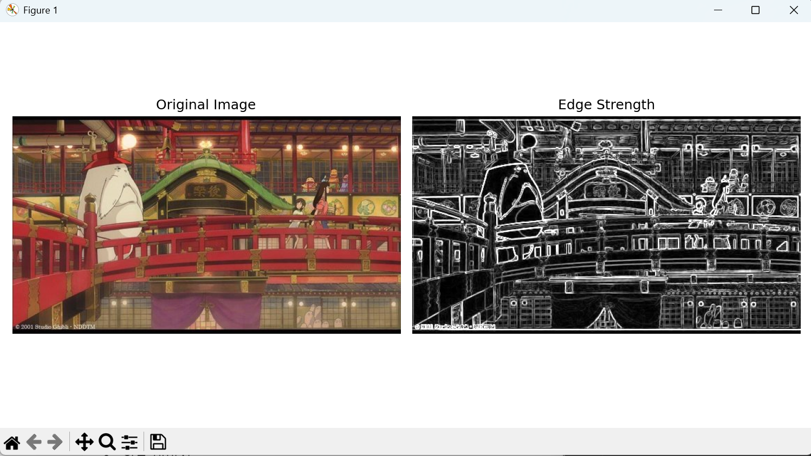
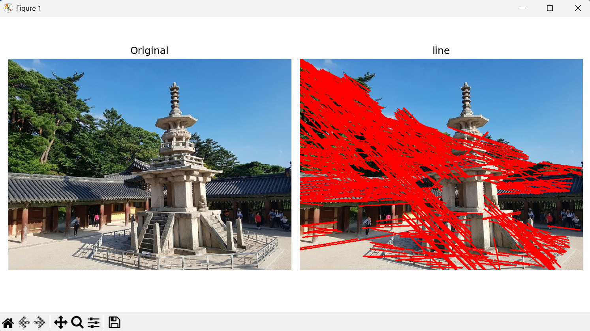
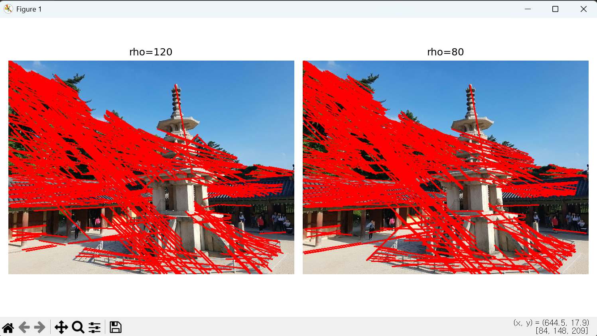
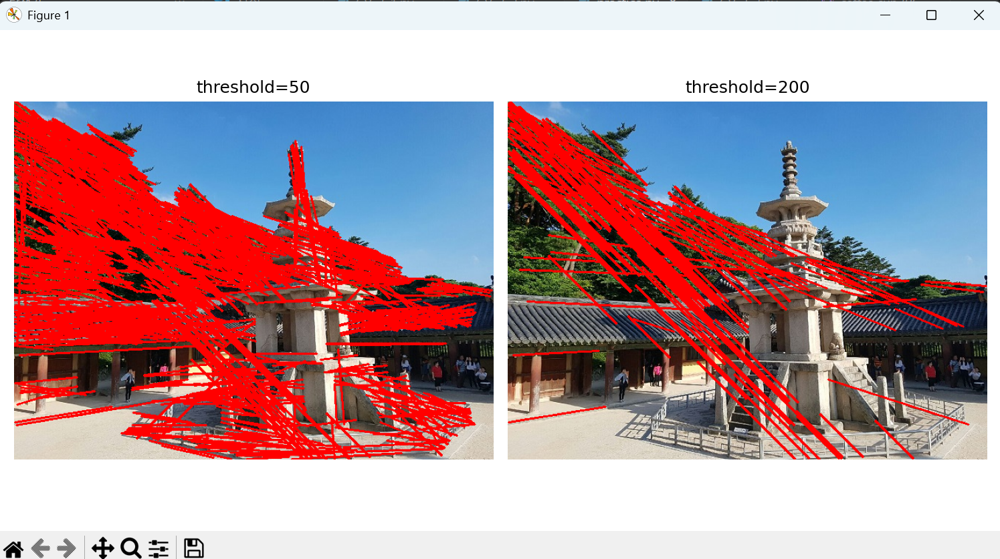
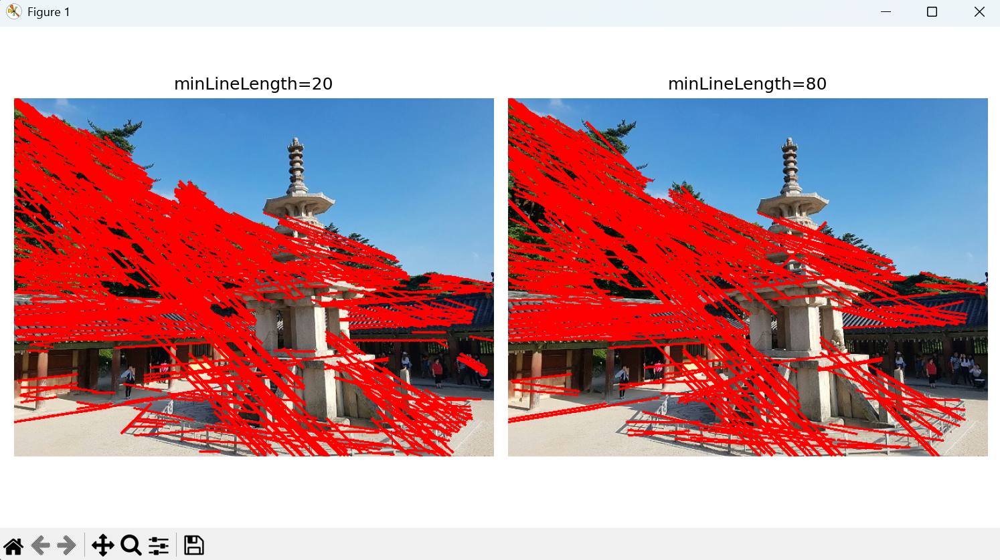
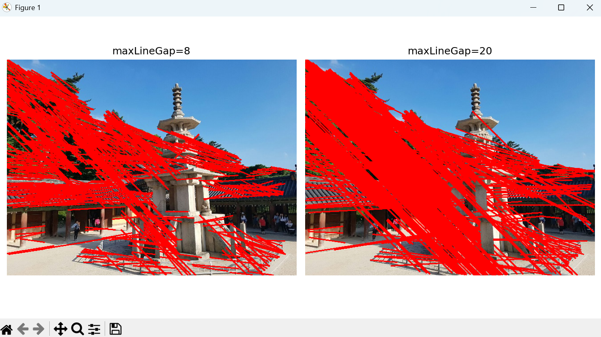
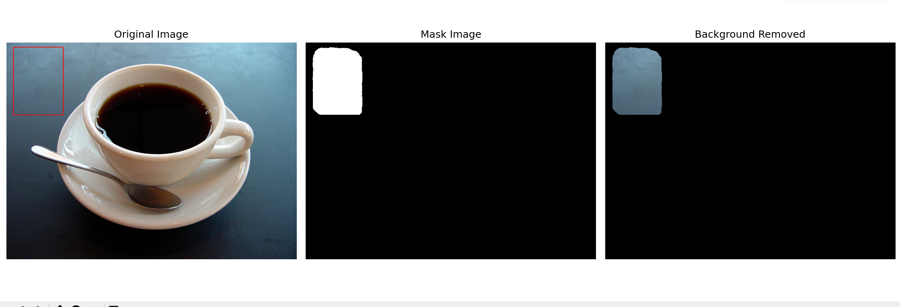

# Computer Vision

# CV3_Edge and Region실습


## 실습3_1 소벨 에지 검출 및 결과 시각화
- edgeDetectionImage이미지를 그레이스케일로 변환
- Sobel 필터를 사용하여 x축과 y출 방향의 에지를 검출
- 검출된 에지 강도 이미지를 시각화

### 요구사항
1. cv.imread()를 사용하여 이미지를 불러옴
2. cv.cvtColor()를 사용하여 그레이스케일로 변환
3. cv.Sobel()을 사용하여 x축(cv.CV_64F, 1, 0)과 y축(cv.CV_64F, 0, 1)방향의 에지를 검출
4. cv.magnitude()를 사용하여 에지 강도 계산
5. Matplotlib를 사용하여 원본 이미지와 에지 강도 이미지를 나란히 시각화

### 전체 코드
```python
import cv2 as cv #opencv라이브러리 불러오기
import matplotlib.pyplot as plt #Matplotlib를 사용하기위해 pyplot 모듈 불러오기

#이미지 파일 불러오기(BGR 형식)
org = cv.imread("edgeDetectionImage.jpg")
#그레이 스케일 변환
gray = cv.cvtColor(org, cv.COLOR_BGR2GRAY)

#Sobel 필터를 사용하여 x방향, y방향 각각 에지 검출
gray_x=cv.Sobel(gray, cv.CV_64F, 1, 0, ksize=3) # (1,0)-> x방향 미분
gray_y=cv.Sobel(gray, cv.CV_64F, 0, 1, ksize=3) # (0,1)-> y방향 미분
#cv.Sobel(입력이미지, 출력 데이터 타입, dx, dy, 커널 크기)
#64비트 부호 있는 실수형(F)으로 결과를 저장하여 음수값도 표현할 수 있도록 함

#x, y방향 에지 값을 이용하여 전체 에지 강도 계산
edge_strength=cv.magnitude(gray_x, gray_y) #에지 강도 계산

#계산된 에지 강도는 실수형이므로 시각화를 위해 절댓값을 취하고 uint8로 변환
edge_strength = cv.convertScaleAbs(edge_strength)

#Matplotlib는 RGB를 사용하기 때문에 원본 이미지를 RGB로 변환
org = cv.cvtColor(org, cv.COLOR_BGR2RGB) 

#전체 출력 화면 크기 설정
plt.figure(figsize=(10, 5)) 

plt.subplot(1,2,1) #출력 화면을 1행2열로 나눴을때 첫번째 위치에 원본 이미지 표시
plt.imshow(org) #원본 이미지 출력
plt.title("Original Image") #제목 표시
plt.axis("off") #깔끔한 표시를 위해 축 제거

plt.subplot(1,2,2) #출력 화면을 1행2열로 나눴을때 두번째 위치에 에지 강도 이미지 표시
plt.imshow(edge_strength, cmap='gray') #에지 강도 이미지를 그레이스케일로 출력
plt.title("Edge Strength") #제목 표시
plt.axis("off") #깔끔한 표시를 위해 축 제거

#subplot 간 간격을 자동으로 조절하여 겹치지 않게 함
plt.tight_layout()

#화면에 출력
plt.show()
```
### 결과 이미지


### 기억사항
```python
org = cv.cvtColor(org, cv.COLOR_BGR2RGB)

plt.figure(figsize=(10, 5)) 

plt.subplot(1,2,1)
plt.imshow(org)
plt.title("Original Image")
plt.axis("off")

plt.subplot(1,2,2) 
plt.imshow(edge_strength, cmap='gray') 
plt.title("Edge Strength") 
plt.axis("off") 

plt.tight_layout()

plt.show()
```
cv2를 사용하여 이미지를 불러오면 BGR형식으로 불러와진다.  
Matplotilb는 RGB형식을 사용하기 때문에 출력할 사진의 형식을 RGB로 변환해준다  
★edg_strength는 그레이스케일(1채널)이기때문에 바꿀 필요가 없다  

plt.figure(figsize=(a, b))  
-> a*b 사이즈의 사진을 넣어 출력할 창을 만들어준다  
plt.subplot(행, 열, 자리)  
-> 출력할 창을 행과 열로 나누었을때 자리 번호에 맞는 곳에 출력할 이미지가 들어간다  
plt.axis("off")  
-> 행렬을 나눈 선을 보이지 않게 만든다(깔끔함)  
plt.tight_layout()  
-> 이미 나눠진 칸의 간격을 정리해준다  

```python
gray_x=cv.Sobel(gray, cv.CV_64F, 1, 0, ksize=3) # (1,0)-> x방향 미분
gray_y=cv.Sobel(gray, cv.CV_64F, 0, 1, ksize=3) # (0,1)-> y방향 미분
```
에지를 검출하기 위해 사용하는 코드  
cv.Sobel(입력이미지, 출력 데이터 타입, dx, dy, 커널 크기)형식으로 작성


```python
edge_strength=cv.magnitude(gray_x, gray_y) 
edge_strength = cv.convertScaleAbs(edge_strength)
```
edge_strength=cv.magnitude(gray_x, gray_y)  
x방향 변화와 y방향 변화를 하나로 합쳐서 최종 에지 세기를 만드는 함수  
edge_strength = cv.convertScaleAbs(edge_strength)  
화면에 보이는 이미지 형태로 바꾸어줌  

## 실습3_2 케니 에지 및 허프 변환을 이용한 직선 검출
- dabo 이미지에 캐니 에지 검출을 사용하여 에지 맵 생성
- 허프 변환을 사용하여 이미지에서 직선 검출
- 검출된 직선을 원본 이미지에서 빨간색으로 표시

### 요구사항
1. cv.Canny()를 사용하여 에지 맵 생성
2. cv.HoughiLinesP()를 사용하여 직선 검출
3. cv.line()을 사용하여 검출된 직선을 원본 이미지에 그림
4. Matplotilb를 사용하여 원본 이미지와 직선이 그려진 이미지를 나란히 시각화

### 전체 코드
```python
import cv2 as cv#opencv라이브러리 불러오기
import matplotlib.pyplot as plt #Matplotlib를 사용하기위해 pyplot 모듈 불러오기
import numpy as np #NumPy 라이브러리 불러오기

#이미지 파일 불러오기
org = cv.imread("dabo.jpg")
#원본 이미지를 복사하여 결과 이미지로 사용
result = org.copy() 
#그레이 스케일 변환
gray = cv.cvtColor(result, cv.COLOR_BGR2GRAY)

#Canny 알고리즘을 이용해 에지 검출 (낮은 임계값: 100, 높은 임계값: 200)
#값이 클수록 강한 에지만 검출됨
canny=cv.Canny(gray, 100, 200)

#직선 검출
#cv.HoughLinesP(입력이미지, 거리 해상도, 각도 해상도, 임계값, 최소 선 길이, 최대 선 간격)
lines=cv.HoughLinesP(canny,1, np.pi/180, threshold=120, minLineLength=50, maxLineGap=10) #허프 변환을 이용한 선 검출

#검출된 직선을 이미지에 그리기
#lines: 검출된 선들의 배열
for line in lines:
    x1, y1, x2, y2 = line[0] #각 직선은 (x1, y1, x2, y2) 형태로 저장되어 있음

    #cv.line(이미지, 시작점, 끝점, 색상, 두께) 
    #BGR 형식으로 색을 지정하여 (0, 0, 255)가 빨간색을 의미
    cv.line(result, (x1, y1), (x2, y2), (0, 0, 255), 2) 

org = cv.cvtColor(org, cv.COLOR_BGR2RGB) #Matplotlib는 RGB를 사용하기 때문에 원본 이미지를 RGB로 변환
result = cv.cvtColor(result, cv.COLOR_BGR2RGB) #결과 이미지도 RGB로 변환

#전체 출력 화면 크기 설정
plt.figure(figsize=(10, 5)) 

plt.subplot(1,2,1) #출력 화면을 1행2열로 나눴을때 첫번째 위치에 원본 이미지 표시
plt.imshow(org) #원본 이미지 출력
plt.title("Original") #제목 표시
plt.axis("off") #깔끔한 표시를 위해 축 제거

plt.subplot(1,2,2) #출력 화면을 1행2열로 나눴을때 두번째 위치에 에지 강도 이미지 표시
plt.imshow(result) #에지 강도 이미지를 그레이스케일로 출력
plt.title("line") #제목 표시
plt.axis("off") #깔끔한 표시를 위해 축 제거

#subplot 간 간격을 자동으로 조절하여 겹치지 않게 함
plt.tight_layout()

#화면에 출력
plt.show()
```

### 결과 이미지


### 기억사항
```python
canny=cv.Canny(gray, 100, 200)
```
cv.Canny(입력 이미지, 낮은 임계값, 높은 임계값)  
에지를 검출하기 위한 함수  
값이 클수록 강한 에지만 검출된다.

```python
lines=cv.HoughLinesP(canny,1, np.pi/180, threshold=100, minLineLength=50, maxLineGap=10) 
```
cv.HoughLinesP(입력이미지, 거리 해상도, 각도 해상도(rho), 임계값(threshold), 최소 선길이, 최대선간격)  
허프변환을 이용한 선 검출 방법
### 내부 값들을 변경한 결과들
변경된 값 이외에 다른 값들은 위와 동일함






```python
for line in lines:
    x1, y1, x2, y2 = line[0] 
    cv.line(result, (x1, y1), (x2, y2), (0, 0, 255), 2)
```
허프 변환을 통해 검출된 선의 좌표들을 이용하여 이미지 위로 라인을 그림  
cv.line(이미지, 시작점, 끝점, 색상, 두께)  
이미지 위에 검출된 직선을 그림  

## 실습3_3 GrabCut을 이용한 대화식 영역 분할 및 객체 추출
- coffee cup 이미지로 사용자가 지정한 사각형 영역을 바탕으로 GrabCut 알고리즘을 사용하여 객체 추출
- 객체 추출 결과를 마스크 형태로 시각화
- 원본 이미지에서 배경을 제거하고 객체만 남은 이미지 출력

### 요구사항
1. cv.grabCut()를 사용하여 대화식 분할을 수행
2. 초기 사각형 영역은 (x,y, width, height)형식으로 지정
3. 마스크를 사용하여 원본 이미지에서 배경을 제거
4. matplotlib를 사용하여 원본 이미지, 마스크 이미지, 배경 제거 이미지 세 개를 나란히 시각화

### 전체코드
```python
import cv2 as cv#opencv라이브러리 불러오기
import matplotlib.pyplot as plt #Matplotlib를 사용하기위해 pyplot 모듈 불러오기
import numpy as np #NumPy 라이브러리 불러오기

#이미지 파일 불러오기
img = cv.imread("coffee cup.jpg")
#Matplotlib는 RGB를 사용하기 때문에 원본 이미지를 RGB로 변환
img_rgb = cv.cvtColor(img, cv.COLOR_BGR2RGB)

#mask는 이미지와 같은 높이, 너비를 가짐
#각 픽셀이 배경인지 객체인지에 대한 정보를 저장하는 배열
#처음은 전부 0으로 초기화
mask = np.zeros(img.shape[:2], np.uint8)

#bgdModel : 배경 모델 저장용 배열
#fgdModel : 객체 모델 저장용 배열
#GrabCut 내부 알고리즘에서 사용되며 직접 값을 넣을 필요 없음
bgdModel = np.zeros((1, 65), np.float64)
fgdModel = np.zeros((1, 65), np.float64)

#객체가 포함된 대략적인 사각형 영역을 지정
#(x, y, w, h) 형태로 사각형의 왼쪽 상단 좌표와 너비, 높이를 지정
rect = (100, 80, 1000, 800)

#cv.grabCut(입력이미지, 배경/객체 정보를 저장할 마스크, 
# 초기 사각형영역, 배경모델, 객체모델, 반복횟수, 초기화 방법)
cv.grabCut(img, mask, rect, bgdModel, fgdModel, 5, cv.GC_INIT_WITH_RECT)

# 확실한 배경(0) + 배경일 가능성이 큰 영역(2)은 0
# 나머지(객체 / 객체일 가능성이 큰 영역)는 1
mask2 = np.where((mask == cv.GC_BGD) | (mask == cv.GC_PR_BGD), 0, 1).astype("uint8")

#객체 영역은 유지되고, 배경 영역은 제거된 결과 이미지 생성
result = img_rgb * mask2[:, :, np.newaxis]

#mask는 0과 1로 이루어진 이진 이미지이므로 시각화를 위해 255를 곱하여 흑백으로 표시
#배경은 검정(0), 객체는 흰색(255)으로 표시
mask_vis = mask2 * 255

#원본 RGB 이미지를 복사하여 사각형을 그릴 별도 이미지 생성
img_rect = img_rgb.copy()
x, y, w, h = rect #rect에서 사각형의 위치와 크기를 추출
#초기 사각형 영역을 파란색으로 그림
#cv.rectangle(이미지, 시작점, 끝점, 색상, 두께)
cv.rectangle(img_rect, (x, y), (x + w, y + h), (255, 0, 0), 2)

#전체 출력 화면 크기 설정
plt.figure(figsize=(15, 5)) 

plt.subplot(1,3,1) #출력 화면을 1행3열로 나눴을때 첫번째 위치에 원본 이미지 표시
plt.imshow(img_rect) #원본 이미지 출력
plt.title("Original") #제목 표시
plt.axis("off") #깔끔한 표시를 위해 축 제거

plt.subplot(1,3,2) #출력 화면을 1행3열로 나눴을때 두번째 위치에 에지 강도 이미지 표시
plt.imshow(mask_vis, cmap="gray") #에지 강도 이미지를 그레이스케일로 출력
plt.title("Mask Image") #제목 표시
plt.axis("off") #깔끔한 표시를 위해 축 제거

plt.subplot(1,3,3) #출력 화면을 1행3열로 나눴을때 세번째 위치에 에지 강도 이미지 표시
plt.imshow(result) #에지 강도 이미지를 그레이스케일로 출력
plt.title("Background Removed") #제목 표시
plt.axis("off") #깔끔한 표시를 위해 축 제거

#subplot 간 간격을 자동으로 조절하여 겹치지 않게 함
plt.tight_layout()

#화면에 출력
plt.show()
```

### 결과 이미지
)

### 기억사항
```python
mask = np.zeros(img.shape[:2], np.uint8)

bgdModel = np.zeros((1, 65), np.float64)
fgdModel = np.zeros((1, 65), np.float64)

rect = (100, 80, 1000, 800)
```
GrabCut을 실행하기 위해 필요한 준비 과정  
1번줄 GrabCut 결과를 저장할 마스크 생성  
2,3번줄 GrabCut이 내부적으로 쓸 배경/객체 모델  
4번줄 객체를 포함하는 초기 사각형  

```python
cv.grabCut(img, mask, rect, bgdModel, fgdModel, 5, cv.GC_INIT_WITH_RECT)
```
배경과 객체 분할 수행  
cv.grabCut(입력이미지, 정보를 저장할 마스크, 초기 영역, 배경모델, 객체모델, 반복횟수, 초기화 방법)

```python
mask2 = np.where((mask == cv.GC_BGD) | (mask == cv.GC_PR_BGD), 0, 1).astype("uint8")

result = img_rgb * mask2[:, :, np.newaxis]
```
배경은 0, 객체는 1로 단순화 시켜 배경이 제거되고 객체만 남은 이미지 생성

```python
mask_vis = mask2 * 255
```
마스크 이미지 생성  
0,1로 단순화 시킨 값에 225를 곱하여 검은색과 흰색으로 객체와 배경을 구분함
