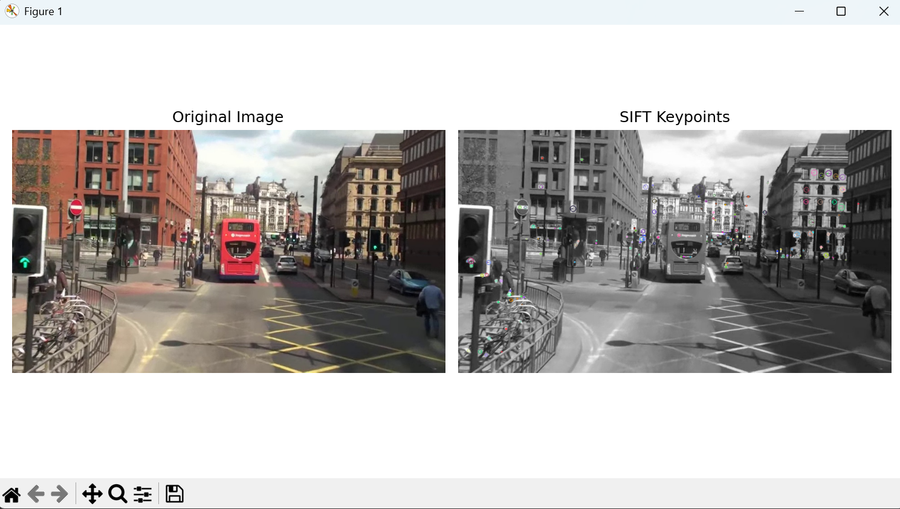
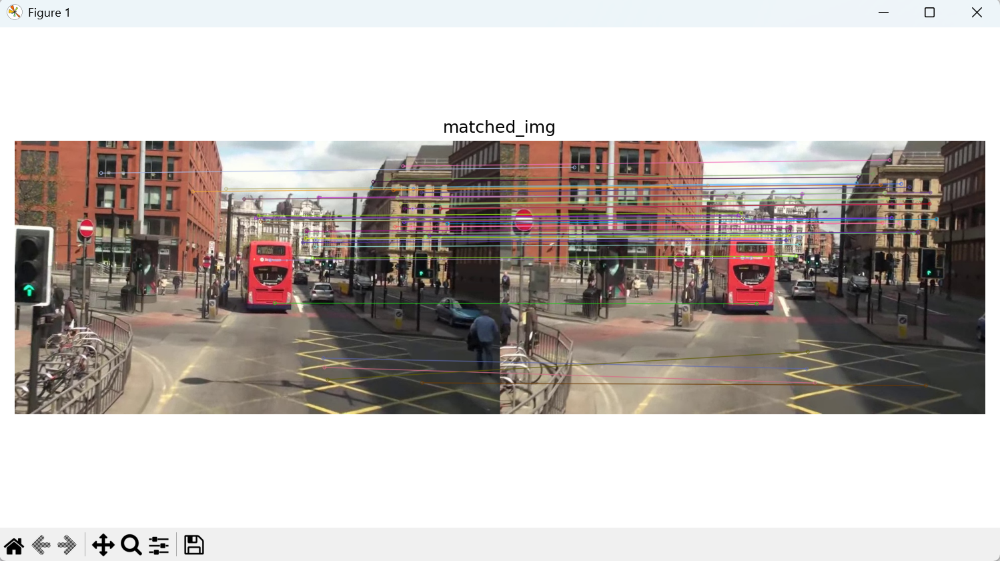
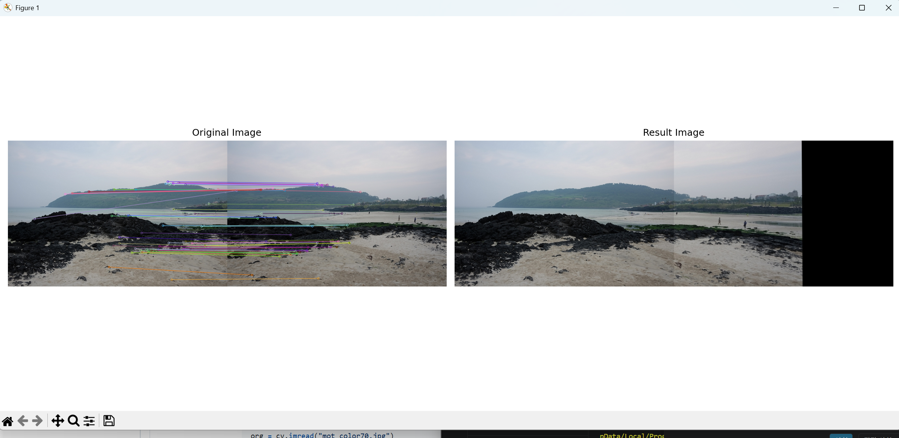

# Computer Vision

# CV4_Local Feature실습


## 실습4_1 SIFT를 이용한 특징점 검출 및 시각화
- 주어진 이미지(mot_color70.jpg)를 이용하여 SIFT(Scale-Invariant Feature Transform)알고리즘을 사용하여 특징점을 검출하고 이를 시각화

### 요구사항
1. cv.SIFT_create()를 사용하여 SIFT 객체를 생성
2. detectAndCompute()를 사용하여 특징점을 검출
3. cv.drawKeypoints()를 사용하여 특징점을 이미지에 시각화
4. matplotlib을 이용하여 원본 이미지와 특징점이 시각화된 이미지를 나란히 출력

### 전체 코드
```python

```
### 결과 이미지


### 기억사항
```python

```

## 실습4_2 SIFT를 이용한 두 영상 간 특징점 매칭
- 두 개의 이미지(mot_color70.jpg,mot_color80.jpg)를 입력받아 SIFT특징점 기반으로 매칭을 수행하고 시각화

### 요구사항
1. cv.imread()를 사용하여 두 개의 이미지를 불러옴
2. cv.SIFT_create()를 사용하여 특징점을 추출
3. cv.BFMatcher()또는 cv.FlannBasedMatcher()를 사용하여 두 영상 간 특징점을 매칭
4. cv.drawMatches를 사용하여 매칭 결과를 시각화
5. matplotlib을 이용하여 매칭 결과를 출력

### 전체 코드
```python

```

### 결과 이미지


### 기억사항
```python

```

## 실습4_3 호모그래피를 이용한 이미지 정합(Image Alignment)
- SIFT특징점을 사용하여 두 이미지 간 대응점을 찾고, 이를 바탕으로 호모그래피를 계산하여 하나의 이미지 위에 정렬
- 샘플파일로 img1.jpg, img2.jpg, img3.jpg 중 2개를 선택

### 요구사항
1. cv.imread()를 사용하여 두 개의 이미지를 불러옴
2. cv.SIFT_creat()를 사용하여 특징점을 검출
3. cv.BFMatcher와 knnMatch()를 사용하여 특징점을 매칭하고, 좋은 매칭점만 선별
4. cv.findHomography()를 사용하여 호모그래피 행렬을 계산
5. cv.warpPerspective()를 사용하여 한 이미지를 변환하여 다른 이미지와 정렬
6. 변환된 이미지(Warped Image)와 특징점 매칭 결과(Matching Result)를 나란히 출력

### 전체코드
```python

```

### 결과 이미지
)

### 기억사항
```python

```
