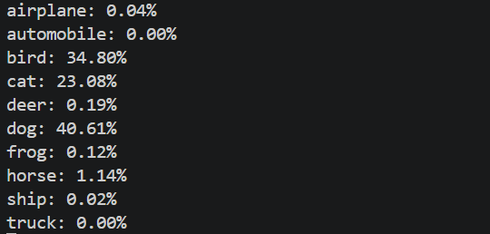

# Computer Vision

# CV5_실습 Image Recognition


## 실습5_1 간단한 이미지 분류기 구현
- 손글씨 숫자 이미지(MNIST 데이터셋)를 이용하여 간단한 이미지 분류기를 구현

### 요구사항
1. MNIST 데이터셋을 로드
2. 데이터를 훈련 세트와 테스트 세트로 분할
3. 간단한 신경망 모델을 구축
4. 모델을 훈련시키고 정확도를 평가

### 전체 코드
```python
import tensorflow as tf  # TensorFlow 라이브러리
from tensorflow.keras.datasets import mnist  # MNIST 데이터셋
from tensorflow.keras.models import Sequential  # 모델 구조
from tensorflow.keras.layers import Dense  # Dense 레이어

# x_train: 학습용 이미지, y_train: 학습용 라벨
# x_test: 테스트 이미지, y_test: 테스트 라벨
(x_train, y_train), (x_test, y_test) = mnist.load_data()

# 정규화 (0~255 → 0~1)
x_train = x_train / 255.0
x_test = x_test / 255.0

# 1차원 변환 (28x28 → 784)
# Dense 레이어는 1차원 입력만 받기 때문에 이미지 데이터를 1차원으로 변환해야 함
x_train = x_train.reshape(-1, 784)
x_test = x_test.reshape(-1, 784)

#신경망 모델 생성
model = Sequential([
    Dense(128, activation='relu', input_shape=(784,)), #입력데이터784개, 변환데이터128개
    Dense(64, activation='relu'), #변환데이터128개, 변환데이터64개로 변환
    Dense(10, activation='softmax') #변환데이터64개, 출력데이터10개 (0~9 숫자 분류)
    #각 클래스일 확률로 변환
])

#모델 컴파일
model.compile(optimizer='adam', loss='sparse_categorical_crossentropy', 
    metrics=['accuracy'])

#모델 학습 (입력데이터, 정답, 전체 데이터 5회 반복)
model.fit(x_train, y_train, epochs=5)
#모델 평가
test_loss, test_acc = model.evaluate(x_test, y_test)
#최종 정확도 출력
print("테스트 정확도:", test_acc)
```
### 결과 
테스트 정확도: 0.9768000245094299

### 기억사항
```python
# 정규화 (0~255 → 0~1)
x_train = x_train / 255.0
x_test = x_test / 255.0
```
정규화 하는 이유
- 값을 줄여 계산을 더욱안정적으로 할 수 있음
- 값들 끼리의 차이가 너무 크면 특정 값에 과하게 영향을 받을 수 있어 값의 범위를 비슷하게 만듦

```python
#모델 컴파일 (가중치, 손실함수, 정확도 측정)
model.compile(optimizer='adam', loss='sparse_categorical_crossentropy', 
    metrics=['accuracy'])
```
모델 컴파일
- model.compile(가중치, 손실함수, 정확도 측정)
- Adam: 자동으로 학습률 조절, 빠르고 안정적
- 모델 학습 설정 단계

## 실습5_2 CIFAR-10 데이터셋을 활용한 CNN모델 구축
- CIFAR-10 데이터셋을 활용하여 합성곱 신경망(CNN)을 구축하고, 이미지 분류를 수행

### 요구사항
1. CIFAR-10 데이터셋을 로드
2. 데이터 전처리(정규화 등)를 수행
3. CNN모델을 설계하고 훈련
4. 모델의 성능을 평가하고, 테스트 이미지(dog.jpg)에 대한 예측을 수행

### 전체 코드
```python
import tensorflow as tf # TensorFlow 라이브러리 불러오기
from tensorflow.keras.datasets import cifar10 # CIFAR-10 데이터셋 불러오기
from tensorflow.keras.models import Sequential #레이어를 순서대로 쌓는 모델 구조
from tensorflow.keras.layers import Conv2D, MaxPooling2D, Flatten, Dense, Dropout #CNN에 필요한 레이더들 불러오기
from tensorflow.keras.preprocessing import image # 외부 이미지를 불러오기위한 라이브러리
import matplotlib.pyplot as plt #이미지 시각화 라이브러리
import numpy as np #배열 계산 및 데이터 처리용 라이브러리


# CIFAR-10 데이터셋의 클래스 숫자를 이름으로 정의
class_names = ['airplane', 'automobile', 'bird', 'cat', 'deer',
               'dog', 'frog', 'horse', 'ship', 'truck']


# CIFAR-10 데이터셋 로드
(x_train, y_train), (x_test, y_test) = cifar10.load_data()


# 데이터 전처리
# 픽셀 값을 0~255 범위에서 0~1 범위로 정규화
x_train = x_train / 255.0
x_test = x_test / 255.0


# CNN 모델 구성
model = Sequential([
    # 첫번째 합성곱층
    # 32개의 필터 이미지 특징 추출
    #입력 이미지 크기: 32x32, 채널 수: 3 (RGB)
    Conv2D(32, (3, 3), activation='relu', input_shape=(32, 32, 3)),

    # 첫 번째 풀링층
    # 이미지의 크기를 줄이고 중요한 정보만 유지
    MaxPooling2D((2, 2)),

    # 두번째 합성곱층
    # 더 복잡한 특징 추출
    Conv2D(64, (3, 3), activation='relu'),

    # 두 번째 풀링층
    # 크기 축소 및 연산량 감소
    MaxPooling2D((2, 2)),

    #2차원 특징맵을 1차원으로 변환(Dense 레이어 입력으로 사용하기 위해)
    Flatten(),
    # 완전 연결층
    Dense(64, activation='relu'),
    #출력층
    #10개의 클래스에 대한 확률출력
    Dense(10, activation='softmax')
])


# 모델 컴파일
model.compile(optimizer='adam',loss='sparse_categorical_crossentropy',
    metrics=['accuracy'])


# 모델 학습
history = model.fit(x_train, y_train,
    epochs=5, validation_data=(x_test, y_test))


# 테스트 데이터로 모델 평가
test_loss, test_acc = model.evaluate(x_test, y_test)
print("테스트 정확도:", test_acc)


# dog.jpg 이미지 불러오기
# CIFAR-10 입력 크기에 맞게 32x32로 조정
img = image.load_img('dog.jpg', target_size=(32, 32))

# 이미지를 numpy 배열로 변환
img_array = image.img_to_array(img)

# 정규화
img_array = img_array / 255.0

# 배치 차원 추가 -> (1, 32, 32, 3)
img_input = np.expand_dims(img_array, axis=0)


# dog.jpg 예측 수행
prediction = model.predict(img_input)

# 가장 확률이 높은 클래스 인덱스
predicted_label = np.argmax(prediction)

# 예측 확률
confidence = np.max(prediction)

# 결과 출력
plt.imshow(img)#이미지 표시
plt.title(f"predicted: {class_names[predicted_label]}")#예측 결과와 확률 출력
plt.axis('off')
plt.show()
#각 클래스에 대한 예측 확률 출력
for i, prob in enumerate(prediction[0]):
    print(f"{class_names[i]}: {prob*100:.2f}%")
```

### 결과 이미지




### 기억사항
```python
# CNN 모델구성
model = Sequential([
    # 첫번째 합성곱층
    # 32개의 필터 이미지 특징 추출
    #입력 이미지 크기: 32x32, 채널 수: 3 (RGB)
    Conv2D(32, (3, 3), activation='relu', input_shape=(32, 32, 3)),

    # 첫 번째 풀링층
    # 이미지의 크기를 줄이고 중요한 정보만 유지
    MaxPooling2D((2, 2)),

    # 두번째 합성곱층
    # 더 복잡한 특징 추출
    Conv2D(64, (3, 3), activation='relu'),

    # 두 번째 풀링층
    # 크기 축소 및 연산량 감소
    MaxPooling2D((2, 2)),

    #2차원 특징맵을 1차원으로 변환(Dense 레이어 입력으로 사용하기 위해)
    Flatten(),
    # 완전 연결층
    Dense(64, activation='relu'),
    #출력층
    #10개의 클래스에 대한 확률출력
    Dense(10, activation='softmax')
])
```
CNN
- 이미지에서 특징을 추출하고, 압축한 뒤, 이를 기반으로 분류하는 구조
- Conv2D(필터개수, 필터 크기, 변형, 입력 이미지 크기): 이미지를 스캔하여 특징 추출
- MaxPooling2D(나눌 영역): 이미지 크기를 축소하고 중요한 정보 유지
- Flatten: Dense를 사용하기 위해 2차원 데이터를 1차원으로 변환
- Dense는 자동으로 이전 층의 출력 크기를 따라감
