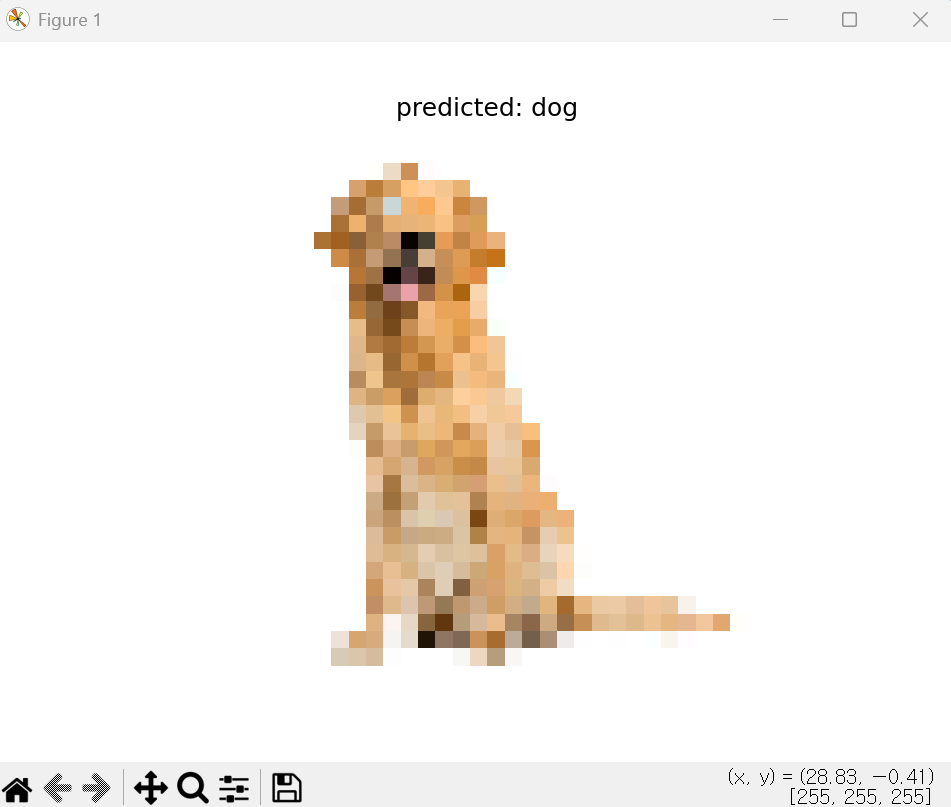

# Computer Vision

# CV5_실습 Image Recognition


## 실습5_1 간단한 이미지 분류기 구현
- 손글씨 숫자 이미지(MNIST 데이터셋)를 이용하여 간단한 이미지 분류기를 구현

### 요구사항
1. MNIST 데이터셋을 로드
2. 데이터를 훈련 세트와 테스트 세트로 분할
3. 간단한 신경망 모델을 구축
4. 모델을 훈련시키고 정확도를 평가

### 전체 코드
```python
import tensorflow as tf  # TensorFlow 라이브러리
from tensorflow.keras.datasets import mnist  # MNIST 데이터셋
from tensorflow.keras.models import Sequential  # 모델 구조
from tensorflow.keras.layers import Dense  # Dense 레이어

# x_train: 학습용 이미지, y_train: 학습용 라벨
# x_test: 테스트 이미지, y_test: 테스트 라벨
(x_train, y_train), (x_test, y_test) = mnist.load_data()

# 정규화 (0~255 → 0~1)
x_train = x_train / 255.0
x_test = x_test / 255.0

# 1차원 변환 (28x28 → 784)
# Dense 레이어는 1차원 입력만 받기 때문에 이미지 데이터를 1차원으로 변환해야 함
x_train = x_train.reshape(-1, 784)
x_test = x_test.reshape(-1, 784)

#신경망 모델 생성
model = Sequential([
    Dense(128, activation='relu', input_shape=(784,)), #입력데이터784개, 변환데이터128개
    Dense(64, activation='relu'), #변환데이터128개, 변환데이터64개로 변환
    Dense(10, activation='softmax') #변환데이터64개, 출력데이터10개 (0~9 숫자 분류)
    #각 클래스일 확률로 변환
])

#모델 컴파일
model.compile(optimizer='adam', loss='sparse_categorical_crossentropy', 
    metrics=['accuracy'])

#모델 학습 (입력데이터, 정답, 전체 데이터 5회 반복)
model.fit(x_train, y_train, epochs=5)
#모델 평가
test_loss, test_acc = model.evaluate(x_test, y_test)
#최종 정확도 출력
print("테스트 정확도:", test_acc)
```
### 결과 
테스트 정확도: 0.9768000245094299

### 기억사항
```python
# 정규화 (0~255 → 0~1)
x_train = x_train / 255.0
x_test = x_test / 255.0
```
정규화 하는 이유
- 값을 줄여 계산을 더욱안정적으로 할 수 있음
- 값들 끼리의 차이가 너무 크면 특정 값에 과하게 영향을 받을 수 있어 값의 범위를 비슷하게 만듦

```python
#모델 컴파일 (가중치, 손실함수, 정확도 측정)
model.compile(optimizer='adam', loss='sparse_categorical_crossentropy', 
    metrics=['accuracy'])
```
모델 컴파일
- model.compile(가중치, 손실함수, 정확도 측정)
- Adam: 자동으로 학습률 조절, 빠르고 안정적
- 모델 학습 설정 단계

## 실습5_2 CIFAR-10 데이터셋을 활용한 CNN모델 구축
- CIFAR-10 데이터셋을 활용하여 합성곱 신경망(CNN)을 구축하고, 이미지 분류를 수행

### 요구사항
1. CIFAR-10 데이터셋을 로드
2. 데이터 전처리(정규화 등)를 수행
3. CNN모델을 설계하고 훈련
4. 모델의 성능을 평가하고, 테스트 이미지(dog.jpg)에 대한 예측을 수행

### 전체 코드
```python

```

### 결과 이미지


### 기억사항
```python

```
