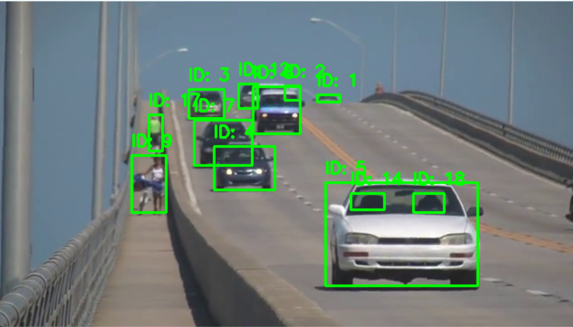
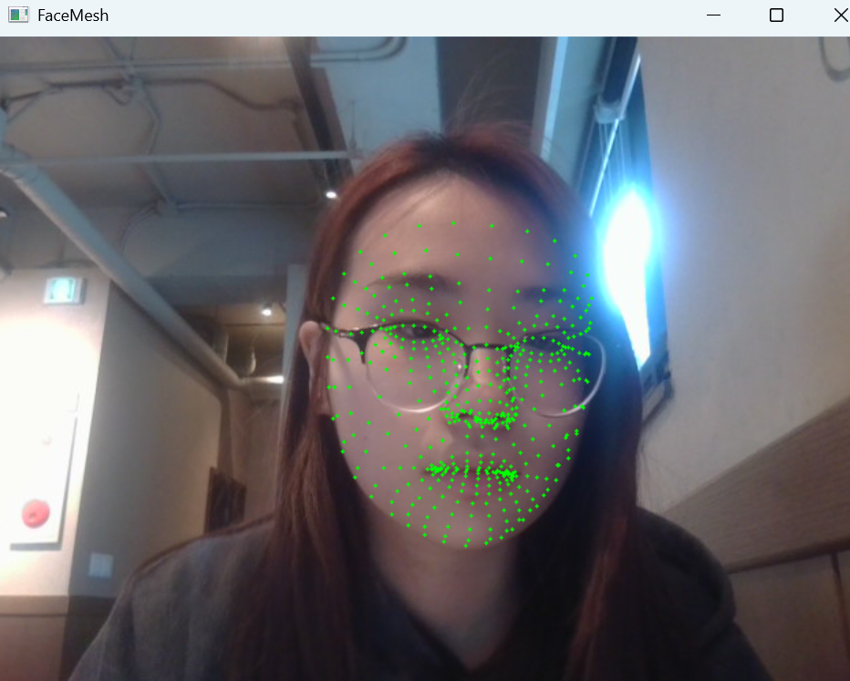

# Computer Vision

# CV6_실습 Dynamic Vision


## 실습6_1 SORT 알고리즘을 활용한 다중 객체 추적기 구현
 - 이 실습에서는 SORT알고리즘을 사용하여 비디오에서 다중 객체를 실시간으로 추적하는 프로그램을 구현합니다.
   이를 통해 객체 추적의 기본 개념과 SORT알고리즘의 적용 방법을 학습할 수 있습니다.

### 요구사항
1. 객체 검출기 구현: YOLOv3와 같은 사전 훈련된 객체 검출 모델을 사용하여 각 프레임에서 객체를 검출합니다.
2. mathworks.comSORT 추적기 초기화: 검출된 객체의 경계 상자를 입력으로 받아 SORT 추적기를 초기화 합니다.
3. 객체 추적: 각 프레임마다 검출된 객체와 기존 추적 객체를 연관시켜 추적을 유지합니다.
4. 결과 시각화: 추적된 각 객체에 고유 ID를 부여하고, 해당 ID와 경계 상자를 비디오 프레임에 표시하여 실시간으로 출력합니다.

### 전체 코드
```python
import cv2 # OpenCV 라이브러리 불러오기
import numpy as np # NumPy 라이브러리 불러오기
from deep_sort_realtime.deepsort_tracker import DeepSort # Deep SORT 트래커 불러오기

weights_path = "yolov3.weights" # YOLOv3 가중치 파일 경로
config_path = "yolov3.cfg" # YOLOv3 구성 파일 경로
video_path = "slow_traffic_small.mp4" # 비디오 파일 경로

# YOLOv3 모델 로드
net = cv2.dnn.readNetFromDarknet(config_path, weights_path)
#모든 레이어 이름 가져오기
layer_names = net.getLayerNames()
#출력 레이어만 추출
output_layers = [layer_names[i - 1] for i in net.getUnconnectedOutLayers().flatten()]

# Deep SORT 추적기 생성
# max_age=30: 객체가 30 프레임 동안 검출되지 않으면 객체 제거
tracker = DeepSort(max_age=30)

cap = cv2.VideoCapture(video_path) #비디오 파일 열기

#영상 프레임 반복 처리
while True:
    #한 프레임 읽기
    ret, frame = cap.read()
    if not ret: #더이상 프레임이 없으면 종료
        break
    #프레임 크기 가져오기
    height, width, _ = frame.shape

    # YOLO 입력용 이미지 생성
    blob = cv2.dnn.blobFromImage(
        frame,          #입력 이미지
        1 / 255.0,      #정규화
        (416, 416),     #YOLO 입력 크기
        swapRB=True,    #RGB로 변환
        crop=False      #이미지 자르지 않음
    )

    net.setInput(blob) #모델에 입력 설정

    # 객체 검출(출력 레이어 결과 얻기)
    outputs = net.forward(output_layers)
    
    boxes = [] #바운딩 박스 저장 리스트
    confidences = [] #신뢰도 저장
    class_ids = [] #클래스 ID 저장

    # 검출 결과 처리
    for output in outputs:
        for detection in output:
            scores = detection[5:] #클레스별 신뢰도 점수
            class_id = np.argmax(scores) #가장 높은 신뢰도의 클레스 선택
            confidence = scores[class_id] #해당 클래스의 확률
            if confidence > 0.5: #신뢰도가 0.5 이상인 경우
                # 중심 좌표
                center_x = int(detection[0] * width)
                center_y = int(detection[1] * height)
                # 박스 크기
                w = int(detection[2] * width)
                h = int(detection[3] * height)
                # 좌상단 좌표
                x = int(center_x - w / 2)
                y = int(center_y - h / 2)

                boxes.append([x, y, w, h]) #박스 정보 저장
                confidences.append(float(confidence)) #신뢰도 저장
                class_ids.append(class_id) #클래스 ID 저장

    # NMS 적용
    #중복 검출 제거
    indices = cv2.dnn.NMSBoxes(boxes, confidences, 0.5, 0.4)

    detections = [] #Deep SORT 입력용 리스트

    # Deep SORT 입력 생성
    if len(indices) > 0: #검출된 객체가 있을 때
        for i in indices.flatten():
            x, y, w, h = boxes[i] #박스 정보 가져오기
            score = confidences[i]#신뢰도

            # class_id를 문자열로 사용
            detections.append(([x, y, w, h], score, str(class_ids[i])))

    # Deep SORT 업데이트
    tracks = tracker.update_tracks(detections, frame=frame)

    # 결과 시각화
    for track in tracks:
        #확정된 객체만
        if not track.is_confirmed():
            continue

        track_id = track.track_id #객체 고유ID
        ltrb = track.to_ltrb() #좌표

        x1, y1, x2, y2 = map(int, ltrb) #좌표 정수로 변환

        # 박스 그리기
        cv2.rectangle(frame, (x1, y1), (x2, y2), (0, 255, 0), 2)

        # ID 표시
        cv2.putText(
            frame,                     
            f"ID: {track_id}",          #텍스트 내용  
            (x1, y1 - 10),              #위치
            cv2.FONT_HERSHEY_SIMPLEX,   #폰트
            0.6,                        #크기
            (0, 255, 0),                #색상
            2                           #두께
        )
    #결과 화면 출력
    cv2.imshow("YOLOv3 + Deep SORT", frame)
    #'q' 키를 누르면 종료
    if cv2.waitKey(1) & 0xFF == ord("q"):
        break


# 비디오 종료
cap.release()
#모든 창 닫기
cv2.destroyAllWindows()
```
### 결과 


### 기억사항
### 객체 검출기(YOLO)
```python
 # YOLO 입력용 이미지 생성
blob = cv2.dnn.blobFromImage(frame, 1 / 255.0, (416, 416), swapRB=True, crop=False)
net.setInput(blob) #모델에 입력 설정
# 객체 검출(출력 레이어 결과 얻기)
outputs = net.forward(output_layers)
scores = detection[5:]
class_id = np.argmax(scores)
confidence = scores[class_id]
```
특정 위치에 어떤 객체가 존자함을 찾음
- 이미지를 YOLO모델 입력 형태로 변환
- 모델에 넣어 객체 후보들을 뽑아냄
- 여러 클래스 중 가장 높은 확률 선택하여 신뢰도를 판단

### MNS (중복제거)
```python
indices = cv2.dnn.NMSBoxes(boxes, confidences, 0.5, 0.4)
```
같은 객체를 여러 박스로 잡는 것을 막기 위해 중복을 제거

### 객체 추적 (Deep SORT)
```python
detections.append(([x, y, w, h], score, str(class_id)))
tracks = tracker.update_tracks(detections, frame=frame)

track.track_id
```
YOLO는 매 프레임 마다 새로 찾기만 하기 때문에 프레임이 바뀌어도 같은 객체를 계속 따라가기 위함
- 각 객체에 고유 ID부여

## 실습6_2 Mediapipe를 활용한 얼굴 랜드마크 추출 및 시각화
- Mediapipe의 FaceMesh 모듈을 사용하여 얼굴의 468개의 랜드마크를 추출하고, 이를 실시간 영상에 시각화하는 프로그램을 구현합니다.

### 요구사항
1. Mediapipe의 FaceMesh모듈을 사용하여 얼굴 랜드마크 검출기를 초기화합니다.
2. OpenCV를 사용하여 웹캠으로부터 실시간 영상을 캡쳐합니다.
3. 검출된 얼굴 랜드마크를 실시간 영상에 점으로 표시합니다.
4. ESC키를 누르면 프로그램이 종료되도록 설정합니다.

### 전체 코드
```python
import cv2 #OpenCV 라이브러리 불러오기
import mediapipe as mp #MediaPipe 라이브러리 불러오기

# MediaPipe의 Face Mesh 솔루션 초기화
mp_face_mesh = mp.solutions.face_mesh
# Face Mesh 객체 생성
face_mesh = mp_face_mesh.FaceMesh()

# 웹캠 열기
#0은 기본 카메라를 의미
cap = cv2.VideoCapture(0)

#웹캠에서 프레임을 반복적으로 읽어오기
while True:
    ret, frame = cap.read()
    if not ret: #프레임을 읽어오지 못하면 종료
        break
    # 현재 프레임의 크기
    h, w, _ = frame.shape

    # BGR → RGB 변환
    rgb_frame = cv2.cvtColor(frame, cv2.COLOR_BGR2RGB)

    # 얼굴 랜드마크 검출
    result = face_mesh.process(rgb_frame)

    # 검출 된 얼굴 랜드마크 그리기
    if result.multi_face_landmarks:
        #검출된 각 얼국에 대해 반복
        for face_landmarks in result.multi_face_landmarks:
            #얼굴의 각 랜드마크 점에 대해 반복
            for lm in face_landmarks.landmark:
                #랜드마크 좌표를 이미지 크기에 맞게 변환
                x = int(lm.x * w)
                y = int(lm.y * h)
                #좌표 위 초록색 점 그리기
                cv2.circle(frame, (x, y), 1, (0, 255, 0), -1)

    # 결과 영상을 화면에 출력
    cv2.imshow("FaceMesh", frame)

    # ESC키를 누르면 종료
    if cv2.waitKey(1) & 0xFF == 27:
        break

# 웹캠 자원 해제
cap.release()
# openCV 창 닫기
cv2.destroyAllWindows()
```
### 결과 이미지


### 기억사항
### 프레임 처리
```python
ret, frame = cap.read()
h, w, _ = frame.shape
```
랜드마크 좌표를 픽셀 좌표로 바꾸기 위해 프레임과 그 크기를 받아옴  
ret: 프레임을 성공적으로 읽어왔는지 확인


### 색상 변환, 얼굴 검출
```python
rgb_frame = cv2.cvtColor(frame, cv2.COLOR_BGR2RGB)
result = face_mesh.process(rgb_frame)
```
mediapipe를 사용하기 위하여 RGB형식으로 변경해줌  
result.multi_face_landmarks: 얼굴마다 랜드마크 정보를 받아옴
